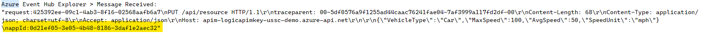

# logic-apim-key

This repo shows an example of how to use [Logic Apps](https://docs.microsoft.com/en-us/azure/logic-apps/single-tenant-overview-compare) to regenerate the primary key in an [Azure API Management](https://docs.microsoft.com/en-us/azure/api-management/api-management-key-concepts) instance. APIM doesn't provide a native way to rotate keys on a regular basis. Rotating API subscription keys is a good security practice since they are just a long password and should not be considered a secure method of authorizing API calls.


This repo also has an example of how to use Logic Apps in combination with an [Azure Function](https://docs.microsoft.com/en-us/azure/azure-functions/functions-overview) and an [Azure Key Vault](https://docs.microsoft.com/en-us/azure/key-vault/general/overview) to generate custom API subscription keys, store them in Key Vault and then set the key in APIM.


This repo also shows you how to use [stateful Logic Apps](https://docs.microsoft.com/en-us/azure/logic-apps/single-tenant-overview-compare#stateful-stateless) to notify subscription owners that their API subscription keys are about to expire and ask them to approve or deny being the owner.

This repo also shows you how to build a simple web app that has a user interactively sign-in and then call an API protected via the OAuth2 [validate-jwt]() token policy. There is also an example of a daemon (background process with no user interactively signed in) accessing this same API. The APIM policy will also log the `Application ID` of the calling AAD application and log the request to [Azure Event Hub](https://docs.microsoft.com/en-us/azure/event-hubs/event-hubs-about) for further processing.


In both cases, the APIM & backing API don't know or care about how the calling application authenticated & got an access token (either via [Authorization Code Flow](https://docs.microsoft.com/en-us/azure/active-directory/develop/v2-oauth2-auth-code-flow) or [Client Credential Flow](https://docs.microsoft.com/en-us/azure/active-directory/develop/v2-oauth2-client-creds-flow)). The same `validate-jwt` policy can be used for both.

## Disclaimer

**THE SOFTWARE IS PROVIDED "AS IS", WITHOUT WARRANTY OF ANY KIND, EXPRESS OR IMPLIED, INCLUDING BUT NOT LIMITED TO THE WARRANTIES OF MERCHANTABILITY, FITNESS FOR A PARTICULAR PURPOSE AND NONINFRINGEMENT. IN NO EVENT SHALL THE AUTHORS OR COPYRIGHT HOLDERS BE LIABLE FOR ANY CLAIM, DAMAGES OR OTHER LIABILITY, WHETHER IN AN ACTION OF CONTRACT, TORT OR OTHERWISE, ARISING FROM, OUT OF OR IN CONNECTION WITH THE SOFTWARE OR THE USE OR OTHER DEALINGS IN THE SOFTWARE.**

## Pre-requisites

- Azure subscription & resource group
- [Azure CLI](https://docs.microsoft.com/en-us/cli/azure/install-azure-cli)
- [dotnet CLI](https://docs.microsoft.com/en-us/dotnet/core/tools/)
- [.NET 6](https://dotnet.microsoft.com/en-us/download/dotnet/6.0)
- [Azure Function CLI](https://docs.microsoft.com/en-us/azure/azure-functions/functions-run-local?tabs=v4%2Cwindows%2Ccsharp%2Cportal%2Cbash)
- [PowerShell](https://docs.microsoft.com/en-us/powershell/scripting/install/installing-powershell?view=powershell-7.2)
- [Visual Studio Code](https://code.visualstudio.com/download)
- [Logic Apps Visual Studio Code Extension](https://docs.microsoft.com/en-us/azure/logic-apps/quickstart-create-logic-apps-visual-studio-code#prerequisites)
- [Event Hub Visual Studio Code Extension](https://marketplace.visualstudio.com/items?itemName=Summer.azure-event-hub-explorer)

## Deployment

### Create App registrations in Azure Active Directory

#### Create App Registration for backend API

1.  Open the `Azure Active Directory` blade in the [Azure portal](https://portal.azure.com)

1.  Click on the `App Registration` blade & click on `Create`

1.  Give it a human-readable name like `logic-apim-key-backend-api`. You don't need to set a `reply uri` at this time.

1.  Take a note of the `TenantId` on the `Overview` blade. You will need this value to correctly set up the APIM `validate-jwt` policy.

1.  Take a note of the `Application Id` that is generated on the `Overview` blade. You will need this value to correctly set up the APIM `validate-jwt` policy to look for the correct `audience`.

1.  On the `Expose an API` blade, click on `Add a scope`. Accept the default `Application ID URI`. Add a scope called `user_impersonation`. **Make a note of the `Application ID URI`.** You will need it when deploying the Azure Resource Manager scripts.

1.  On the `App roles` blade, click on `Add an app role`. Create a new `App Role` called `access_as_user` and select `Application` as the type.

#### Create App Registration for client web app

1.  Open the `Azure Active Directory` blade in the [Azure portal](https://portal.azure.com)

1.  Click on the `App Registration` blade & click on `Create`

1.  Give it a human-readable name like `logic-apim-key-backend-api`. Set the `reply uri to type `Web`and the value to`https://localhost:7071/signin-oidc`.

1.  **Note the `Application (client) ID` & `Directory (tenant) ID`.** You will need these values when configuring the api app.

1.  On the `Certificates and secrets` blade, create a new secret for the client API to use to authenticate (using [Authorization Code Flow]()).

1.  On the `API permissions` blade, click `Add a permission`.

1.  Select `My APIs` and select your backend API. Select the `Delegated permissions` button and then check the box for the `user_impersonation` scope you created earlier.

1.  Click `Add permissions`.

#### Create App Registration for client API app (requrires admin consent)

1.  Open the `Azure Active Directory` blade in the [Azure portal](https://portal.azure.com)

1.  Click on the `App Registration` blade & click on `Create`

1.  Give it a human-readable name like `logic-apim-key-backend-api`. Set the `reply uri` type to `Web` and the value to `https://localhost:7071`.

1.  **Note the `Application (client) ID` & `Directory (tenant) ID`.** You will need these values when configuring the client web app.

1.  On the `Certificates and secrets` blade, create a new secret for the client API to use to authenticate (using [Client Credential Flow]()).

1.  On the `API permissions` blade, click `Add a permission`.

1.  Select `My APIs` and select your backend API. Select the `Application permissions` button and then check the box for the `access_as_user` scope you created earlier.

1.  Click `Add permissions`.

1.  Click on `Grant admin consent for <tenant_name>`. This will allow the client API app to access the backend API. Note that you will need `global admin` to consent.

### Azure Resource Manager deployment

1.  Modify the `infra/env/dev.parameters.json` file as needed for your environment.

1.  Execute the following Azure CLI from the root directory of the repo (substituting your values as needed)

    ```shell
    az deployment group create -g rg-logic-apim-key-ussc-demo --template-file ./infra/main.bicep --parameter ./infra/env/dev.parameters.json --parameter publisherName=dwight publisherEmail=dwight.k.schrute@dunder-mifflin.com tenantId=5bd0289f-3c17-4315-96eb-0e2116fa49fc apiAppIdUri=api://34930f13-7679-40f5-9313-1b6c07dc4c09
    ```

1.  Deploy the Azure Function code (substituting your Azure Function name as needed).

    ```shell
    cd ./web/generate-new-subscription-key-function
    func azure functionapp publish func-logicApimKey-ussc-demo
    ```

1.  Zip up & deploy the Logic App workflows (substituting your values as needed). Change `Compress-Archive` if needed on Linux.

    ```shell
    Compress-Archive -Path ./logic-app/* -DestinationPath ./logic-app.zip -Update

    az logicapp deployment source config-zip --name logic-logicApimKey-ussc-demo --resource-group rg-logic-apim-key-ussc-demo --subscription <subscription-name> --src ./logic-app.zip
    ```

### Initialize Logic App Office 365 connections

You will need to open each Logic App workflow in the Azure portal and initialize it using your credentials to send email.

1.  Open the `Logic App` in your Resource Group.

1.  Click on the `Workflows` blade

1.  Select the `notify-subscription-owner` workflow

1.  Click on the `Designer` blade

1.  Select the `Send an email` command of the `Office 365 Outlook` action.

1.  Click on the `Change connection` link and sign-in to use your credentials to send emails.

1.  Repeat these steps for the other `Send an email` actions in this workflow & the other 2 workflows everywhere the `Send email` command is used.

## How to use Logic Apps to regenerate API subscription keys using native APIM capabilities

The Logic App will go through the following steps to regenerate the API subscription primary key when it is within 30 days of expiring and then notifying the owner.

1.  It will first query the APIM to see what API subscriptions are expiring in the next 30 days.

1.  It will then loop over each one and:

    1.  Regenerate the primary key using the native API for APIM.

    1.  Get the subscription owner ID & product name.

    1.  Send an email to the subscription owner notifying them of the change.

You can right-click on the `logic-app/rotate-subscription-key/workflow.json` file and select `Open in Designer` to see the GUI tool for building Logic Apps.

## How to use Logic Apps to regenerate API subscription keys via an Azure Function, store that new key in Azure Key Vault & set the new key in APIM

The Logic App will go through the following steps to generate a new API subscription primary key when it is within 30 days of expiring, saving it to Key Vault & then setting it in APIM, and then notifying the owner.

1.  It will first query the APIM to see what API subscriptions are expiring in the next 30 days.

1.  It will then loop over each one and:

    1.  Call the Azure Function to generate a new primary key

    1.  Save this new key to Azure Key Vault.

    1.  Set the the primary key using the native API for APIM.

    1.  Get the subscription owner ID & product name.

    1.  Send an email to the subscription owner notifying them of the change.

You can right-click on the `logic-app/set-subscription-key/workflow.json` file and select `Open in Designer` to see the GUI tool for building Logic Apps.

## How to notify API subscription owners and get their approval or denial

The Logic App will go through the following steps to notify the API subscription owner of the API subscription key expiring and wait on their response (using stateful Logic Apps).

1.  It will first query the APIM to see what API subscriptions are expiring in the next 30 days.

1.  It will then loop over each one and:

    1.  Get the subscription owner ID & product name.

    1.  Send an email to the subscription owner notifying them of the expiration and asking them to `Approve` or `Deny`.

    1.  The Logic App will then wait on their response.

    1.  Based upon the response, it will send a follow-up email with an `Approval` or `Denial` email.

You can right-click on the `logic-app/notify-subscription-owner/workflow.json` file and select `Open in Designer` to see the GUI tool for building Logic Apps.

## Run the sample apps

### Set up Event Hub logging in VS Code to see `appid` captured from access tokens

1.  Open VS Code.

1.  Open the `Command Palette` (`Ctrl+Shift+P`) and type in `EventHub: Select EventHub`. Select your Event Hub.

1.  Open the `Command Palette` (`Ctrl+Shift+P`) and type in `EventHub: Start Monitoring Event Hub Message`.

    This will open the `Azure Event Hub Explorer` Output window.

    As you run each app, you will see the output from the Event Hub logger policy in APIM, capturing the `appid` field.

    

### Run the user app

1.  Update the `/web/client/user/appsettings.json` file with your local values.

    - You can get a `EchoAPISubscriptionKey` from the [Azure portal](https://portal.azure.com). Open the `API Management` instance and click on the `subscriptions` blade. Select a `Product` and click on the ellipsis, then click on `Show/hide keys`.

1.  Run the .NET code

    ```shell
    dotnet run --project ./web/client/user
    ```

1.  Run the `Azure Event Hub Explorer` to see the messages being sent to the `eh-logicApimKey-ussc-demo` topic.

1.  Open a browser to the default address (https://localhost:7071)

1.  Sign-in if prompted

1.  Click on the `Call API` button

1.  Notice the values that have been sent to the Event Hub from your policy in APIM.

    

### Run the api app

1.  Update the `/web/client/api/appsettings.json` file with your local values.

    - You can get a `EchoAPISubscriptionKey` from the [Azure portal](https://portal.azure.com). Open the `API Management` instance and click on the `subscriptions` blade. Select a `Product` and click on the ellipsis, then click on `Show/hide keys`.

1.  Run the .NET code

    ```shell
    dotnet run --project ./web/client/api
    ```

1.  Run the `Azure Event Hub Explorer` to see the messages being sent to the `eh-logicApimKey-ussc-demo` topic.

1.  Open a browser to the default address (https://localhost:7108)

1.  Sign-in if prompted

1.  Change the URL to the API endpoint (https://localhost:7108/vehicle)

1.  Notice the values that have been sent to the Event Hub from your policy in APIM.

    

## Links

- [Logic Apps Standard](https://docs.microsoft.com/en-us/azure/logic-apps/single-tenant-overview-compare)
- [Azure API Management](https://docs.microsoft.com/en-us/azure/api-management/api-management-key-concepts)
- [Azure Function](https://docs.microsoft.com/en-us/azure/azure-functions/functions-overview)
- [Azure Key Vault](https://docs.microsoft.com/en-us/azure/key-vault/general/overview)
- [Stateful Logic Apps](https://docs.microsoft.com/en-us/azure/logic-apps/single-tenant-overview-compare#stateful-stateless)
- [Azure Event Hub](https://docs.microsoft.com/en-us/azure/event-hubs/event-hubs-about)
- [Authorization Code Flow](https://docs.microsoft.com/en-us/azure/active-directory/develop/v2-oauth2-auth-code-flow)
- [Client Credential Flow](https://docs.microsoft.com/en-us/azure/active-directory/develop/v2-oauth2-client-creds-flow)
- [Monitor your APIs with Azure API Management, Event Hubs](https://docs.microsoft.com/en-us/azure/api-management/api-management-log-to-eventhub-sample)
